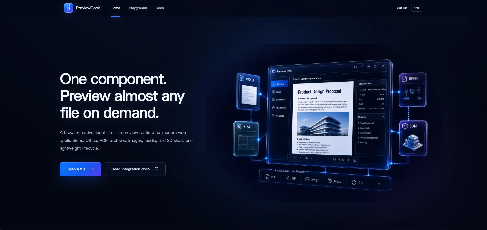
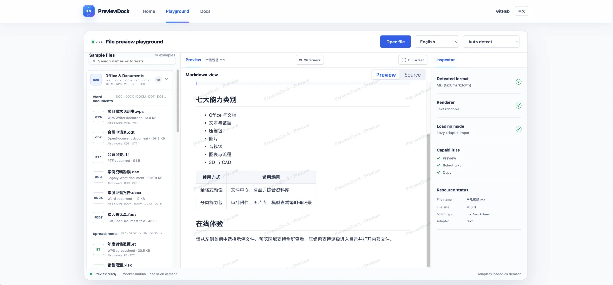

# PreviewDock

[简体中文](./README.md) | [English](./README.en.md)

> A browser-native file preview runtime covering Office documents, text and data, archives, images, media, diagrams and engineering files, and 3D/CAD.

[](https://github.com/lookmyagent/previewdock/actions/workflows/ci.yml)
[](https://www.npmjs.com/package/@previewdock/preset-all)
[](./LICENSE)

[Live playground](https://playground.yigeren.me/playground/?lang=en) · [Documentation](https://playground.yigeren.me/docs/en/) · [Format matrix](https://playground.yigeren.me/docs/en/format-support) · [Issues](https://github.com/lookmyagent/previewdock/issues)

PreviewDock is local-first file preview infrastructure for file centers, knowledge bases, approval attachments, cloud drives, and professional document systems. Files stay in the browser by default and format adapters are loaded on demand. Applications can enable every supported category with one preset or install only the categories they need.

### Product preview

| Landing page | File preview playground |
| --- | --- |
|  |  |

## Why PreviewDock

- **Browser-native and self-hostable**: files do not need to be uploaded to a third-party preview service; Workers, WASM modules, and fonts can ship with your application.
- **Seven format categories**: one runtime for documents, data, archives, design files, media, engineering diagrams, and 3D/CAD.
- **True on-demand loading**: heavy Office, CAD, archive, and media parsers load only when their formats are opened.
- **One API across frameworks**: Vue 3, Vue 2.6/2.7, React 16.8–19, vanilla JavaScript, and Web Components.
- **Two delivery modes**: `preset-all` for universal file centers, or category presets for strict bundle-size and capability boundaries.
- **Production-oriented lifecycle**: consistent loading, errors, cancellation, and cleanup, with internationalization, fullscreen preview, cross-origin isolation, and large-file strategies.

## Get started in three minutes

Vue 3 with the all-format preset:

```bash
pnpm add vue @previewdock/vue @previewdock/preset-all
```

```ts
// preview-engine.ts
import { createAllFormatEngine } from '@previewdock/preset-all'

export const engine = createAllFormatEngine({
  assetBaseUrl: '/previewdock/',
})
```

```vue
<script setup lang="ts">
import { ref } from 'vue'
import { PreviewDock } from '@previewdock/vue'
import '@previewdock/vue/style.css'
import { engine } from './preview-engine'

const file = ref<File>()
</script>

<template>
  <input type="file" @change="file = ($event.target as HTMLInputElement).files?.[0]">
  <PreviewDock v-if="file" :engine="engine" :source="file" :file-name="file.name" />
</template>
```

Heavy formats need runtime assets matching the installed npm package version:

```bash
pnpm add -D @previewdock/assets
pnpm exec previewdock-copy-assets ./public/previewdock
```

Vite applications can use `@previewdock/vite-plugin` to copy assets automatically. See [Getting started](https://playground.yigeren.me/docs/en/getting-started) and [Runtime and deployment](https://playground.yigeren.me/docs/en/deployment) for production setup.

## All-format and modular modes

```bash
# All: enable all seven categories; adapters are still lazy-loaded at runtime
pnpm add @previewdock/preset-all

# Modular: install only document and image capabilities
pnpm add @previewdock/core @previewdock/preset-documents @previewdock/preset-images
```

```ts
import { createViewerEngine } from '@previewdock/core'
import { documentsPack } from '@previewdock/preset-documents'
import { imagesPack } from '@previewdock/preset-images'

const engine = createViewerEngine([documentsPack, imagesPack])
```

Both modes use the same engine and UI components. They differ only in whether all categories or a selected dependency set is installed.

## Framework support

| Scenario | Package | Compatibility |
| --- | --- | --- |
| Vue 3 | `@previewdock/vue` | Vue 3.4+ |
| Vue 2 | `@previewdock/vue2` | Vue 2.6.14 / 2.7 |
| React | `@previewdock/react` | React 16.8 / 17 / 18 / 19 |
| Native Web | `@previewdock/web` | JavaScript API, Custom Element, iframe host |
| Vite asset deployment | `@previewdock/vite-plugin` | Vite 5–7 |

All integrations share the `engine`, `source`, `fileName`, `mimeType`, `locale`, and `messages` options and the `ready`, `error`, and `status` lifecycle events.

## Seven format categories

| Category | Representative formats |
| --- | --- |
| Office & Documents | DOC/DOCX, XLS/XLSX/XLSB, PPT/PPTX, WPS/ET/DPS, PDF/OFD, OpenDocument, RTF, email, e-books |
| Text & Data | TXT, Markdown, source code and configuration, CSV/TSV, JSON/XML, IPYNB, SQLite, Parquet, Avro, WASM |
| Archives | ZIP/ZIPX, RAR, 7Z, TAR, GZIP, BZ2, XZ, ZST, CAB, ISO, APK, comic archives |
| Images & Design | PNG, JPEG, WebP, SVG, TIFF, TGA, PSD, AVIF, HEIC/HEIF, JXL, AI/EPS, fonts |
| Media | MP3, WAV, FLAC, MP4, WebM, MOV, MPEG, HLS, MIDI |
| Diagrams & Engineering | BPMN, XMind, VSD/VSDX, Draw.io, Excalidraw, Mermaid, GeoJSON, KML, GPX, EDA |
| 3D & CAD | GLB/glTF, OBJ, STL, FBX, 3MF, DXF/DWG, STEP, IGES, IFC, 3DM, USD, point clouds |

Formats provide either standard visual preview or structure/quick preview. Refer to the [format support matrix](https://playground.yigeren.me/docs/en/format-support) for the exact support level. PreviewDock never labels a download-only fallback as preview support.

## Core packages

| Package | Purpose |
| --- | --- |
| `@previewdock/core` | Detection, adapter registry, lifecycle, and cancellation |
| `@previewdock/preset-all` | Official all-format preset |
| `@previewdock/preset-*` | Seven modular category presets |
| `@previewdock/vue`, `vue2`, `react`, `web` | Framework integration layers |
| `@previewdock/assets` | Worker, WASM, and font manifest plus copy CLI |
| `@previewdock/vite-plugin` | Automatic runtime asset copying for Vite |
| `@previewdock/adapter-*` | Independently composable format adapters |

## Local development

```bash
pnpm install
pnpm dev             # landing page
pnpm dev:docs        # documentation
pnpm dev:playground  # file preview playground

pnpm test
pnpm typecheck
pnpm build
pnpm release:npm:dry-run
```

## Security boundaries

- Document macros, embedded scripts, and active content are not executed.
- SVG, HTML, Markdown, and email content is sanitized.
- Archives are constrained by file size, expanded size, entry count, and processing time.
- Authentication, authorization, and CORS for remote file URLs remain the host application's responsibility.
- Professional formats should be validated with representative business samples before production rollout.

## License

[Apache-2.0](./LICENSE). Some optional format dependencies have independent licenses; refer to package manifests and [NOTICE](./NOTICE).

Use [Issues](https://github.com/lookmyagent/previewdock/issues) for feedback. Read [CONTRIBUTING.md](CONTRIBUTING.md) and [SECURITY.md](SECURITY.md) before contributing a parser.
